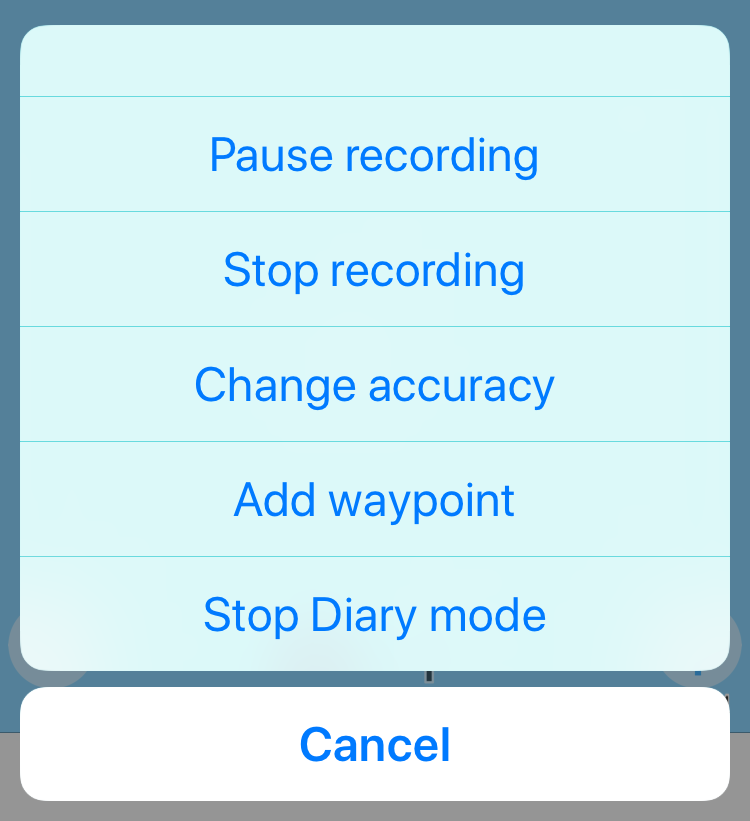

# myTracks と Exiftool による後付けジオタギング（Geotagging）

## TL;DR

1. iPhone 上で myTracks を動かして GPS 記録を収集する
2. GPS のついてないカメラで写真を撮影する
3. ExifTool を使って 1. と 2. のデータを合成し、GPS 位置情報付きの JPEG ファイルを得る

------

## 事前準備

### （iPhone）GPS ロガーソフトウェアのインストール

ExifTool が対応する GPS ログファイルの形式を出力できれば何でも構わないが、筆者の環境では myTracks を使って gpx ファイルを出力する方法がうまくいった。

[myTracks - the GPS solution for all your Apple devices](http://www.mytracks4mac.info/)

------

## 当日準備

### （iPhone）GPS ログの記録開始

GPS ログの記録を開始。myTracks の場合「Start recording」と「Start Dairy mode」を実行する。

### （カメラ）時計を合わせる

後で時刻によるマッチングをとるので、カメラ側の時計を正確に合わせる必要がある。

------

## 帰宅後

### （iPhone）GPS 記録をエクスポート

GPS ログの記録を終了。myTracks の場合「Stop recording」と「Stop Dairy mode」

### 写真を取り出し

カメラから写真を取り出すか現像して、JPEG 形式の写真を準備。

### ジオタギング

[ExifTool by Phil Harvey](https://sno.phy.queensu.ca/~phil/exiftool/)

