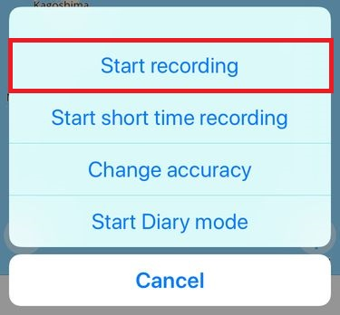
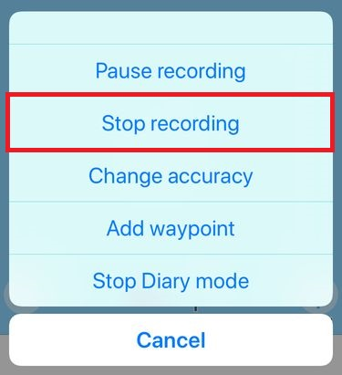
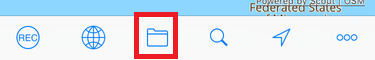
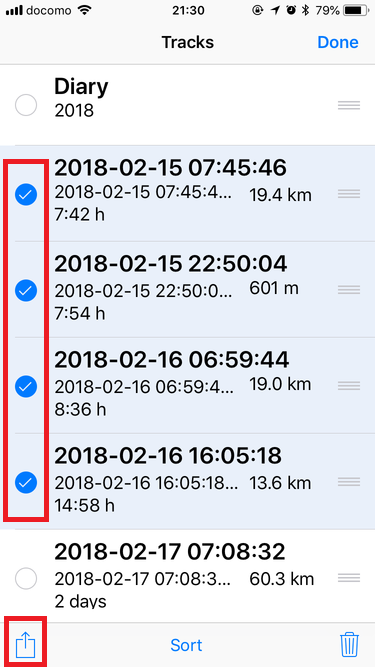
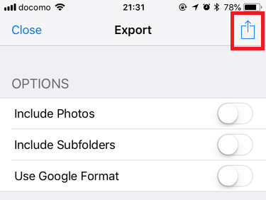
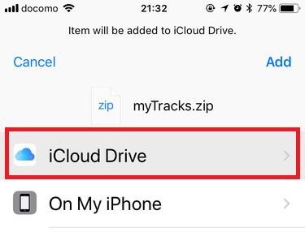

# myTracks と Exiftool による後付けジオタギング（Geotagging）

## TL;DR

1. iPhone 上で myTracks を動かして GPS 記録を収集する
2. GPS のついてないカメラで写真を撮影する
3. ExifTool を使って 1. と 2. のデータを合成し、GPS 位置情報付きの JPEG ファイルを得る

------

## 事前準備

### （iPhone）GPS ロガーソフトウェアのインストール

ExifTool が対応する GPS ログファイルの形式を出力できれば何でも構わないが、筆者の環境では myTracks を使って gpx ファイルを出力する方法がうまくいった。

[myTracks - the GPS solution for all your Apple devices](http://www.mytracks4mac.info/)

------

## 当日準備

### （iPhone）GPS ログの記録開始

GPS ログの記録を開始。myTracks の場合「Start recording」と「Start Dairy mode」を実行する。



### （カメラ）時計を合わせる

後で時刻によるマッチングをとるので、カメラ側の時計を正確に合わせる必要がある。

------

## 帰宅後

### （iPhone）GPS 記録をエクスポート

GPS ログの記録を終了。myTracks の場合「Stop recording」で記録を終了してから、



ファイル一覧を開き、



「Edit」を選んでから、


必要なファイルを選択して、メニューを表示。



オプションを選択してからメニューを表示し、



保存先はどこでもいいが、筆者はよく Files を使っている。


フォルダもどこでも良いが、筆者は iCloud Drive をよく使っている。



うまくエクスポートできると、myTracks.zip が得られる。以下は Windows cygwin で内容を確認した例。

```shell
$ unzip -v /cygdrive/c/Users/username/iCloudDrive/myTracks.zip
Archive:  myTracks.zip
 Length   Method    Size  Cmpr    Date    Time   CRC-32   Name
--------  ------  ------- ---- ---------- ----- --------  ----
 2661116  Defl:N   500960  81% 05-04-2018 18:53 24e48021  2018-05-03 21_57_49.gpx
 2987986  Defl:N   538693  82% 05-04-2018 18:53 fd8d0a8f  2018-05-02 22_47_24.gpx
 1605268  Defl:N   292749  82% 05-04-2018 18:53 8c5cf870  2018-05-01 06_06_23.gpx
 1573376  Defl:N   285022  82% 05-04-2018 18:53 5f2db8b9  2018-04-28 12_31_21.gpx
 1263901  Defl:N   227575  82% 05-04-2018 18:53 446da7c1  2018-04-26 22_10_10.gpx
 1971293  Defl:N   348552  82% 05-04-2018 18:53 ead529a0  2018-04-24 23_52_58.gpx
 1597385  Defl:N   291246  82% 05-04-2018 18:53 94293c1c  2018-04-23 08_25_50.gpx
 3369749  Defl:N   605764  82% 05-04-2018 18:53 7576e3d5  2018-04-18 06_19_48.gpx
 1717289  Defl:N   309748  82% 05-04-2018 18:53 ce86433b  2018-04-16 07_31_36.gpx
--------          -------  ---                            -------
18747363          3400309  82%                            9 files
```

### 写真を取り出し

カメラから写真を取り出すか現像して、JPEG 形式の写真を準備。

### ジオタギング

JPEG があるフォルダで exiftool を実行。以下は Windows cygwin での実行例。

```bash
exiftool -geotag `cygpath -w /path/to/gpx/`*.gpx '-geotime<${createdate}+09:00' -api GeoMaxIntSecs=86400 -api GeoMaxExtSecs=86400 *.jpg;
```

* `'-geotime<${createdate}+09:00'` オブションは、タイムゾーンの修正。Exif 情報はローカル時間で記録されるが GPS 情報は UTC のはずなので、その時差を修正している。
* `-api GeoMaxIntSecs=86400`, `-api GeoMaxExtSecs=86400` オプションは、GPS 記録の時刻と撮影時刻がずれた場合への対処。デフォルトは 1800 秒なので、30 分のずれを許容し線形補完するようになっているが、これを 1 日にまで拡張している。myTracks は、建物内などでは長時間 GPS 記録をとらない場合があるので、このオブションがないと建物内で撮影した写真は位置情報なしになる場合があった。

参考資料

* [Geotagging with ExifTool](https://sno.phy.queensu.ca/~phil/exiftool/geotag.html)

