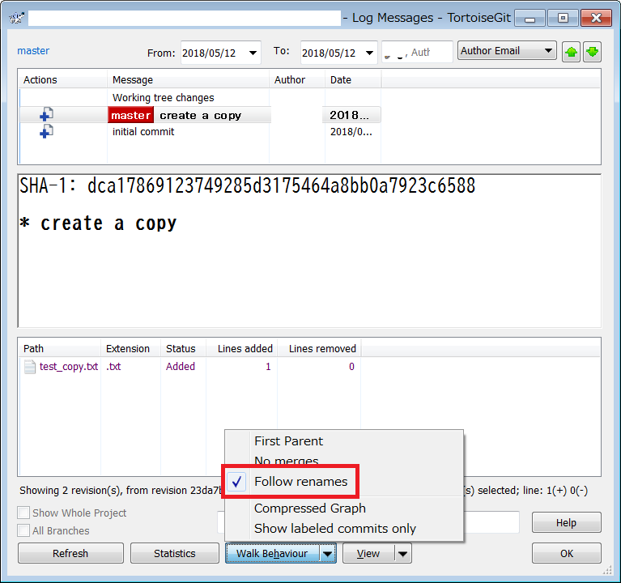

# git におけるファイルコピーと履歴のメモ

git では svn copy のように履歴を引き継いだコピーができないのか試したメモ。

Thanks: https://twitter.com/edp02/status/991673377562681344

## TL;DR

`git log --follow (filename)` とすれば、そのファイルがコピー/移動される前の履歴も参照できる。

## テスト

最初に `test.txt` を作成してコミット

```bash
$ git init
Initialized empty Git repository in (snip)
$ echo 123123123 > test.txt
$ git add test.txt
$ git commit -am 'initial commit'
[master (root-commit) 23da7be] initial commit
 1 file changed, 1 insertion(+)
 create mode 100644 test.txt
```

この段階での `git log` を確認。

```bash
$ git log
commit 23da7beeca879b7a93a1863d963fb0a914720919 (HEAD -> master)
Author: (snip)
Date:   Sat May 12 09:31:01 2018 +0900

    initial commit
```

コピーとして `test_copy.txt` を作成する。

```bash
$ cp test.txt test_copy.txt
$ git add test_copy.txt
$ git commit -am 'create a copy'
[master dca1786] create a copy
 1 file changed, 1 insertion(+)
 create mode 100644 test_copy.txt
```

この段階でのログを確認する。`git log` では、コピーであることはコミットメッセージからしか確認できないことが判る。

```bash
$ git log
commit dca17869123749285d3175464a8bb0a7923c6588 (HEAD -> master)
Author: (snip)
Date:   Sat May 12 09:35:00 2018 +0900

    create a copy

commit 23da7beeca879b7a93a1863d963fb0a914720919
Author: (snip)
Date:   Sat May 12 09:31:01 2018 +0900

    initial commit

```

次に `git log -C -C --name-status` とする`C100` の行を見ると、コピー元ファイルとコピー先ファイルの関係が判るようだ。

```bash
$ git log -C -C --name-status
commit dca17869123749285d3175464a8bb0a7923c6588 (HEAD -> master)
Author: (snip)
Date:   Sat May 12 09:35:00 2018 +0900

    create a copy

C100    test.txt        test_copy.txt

commit 23da7beeca879b7a93a1863d963fb0a914720919
Author: (snip)
Date:   Sat May 12 09:31:01 2018 +0900

    initial commit

A       test.txt

```

次に`git log --follow` を試す。これだけだと、使い方が間違っているようだ。

```bash
$ git log --follow
fatal: --follow requires exactly one pathspec
```

ファイル名を指定する必要があるので、まずコピー後の `git log --follow test_copy.txt` を確認。コピー前のコミットも正しく追跡できていて、これは `svn copy` の時の挙動に近い。

```bash
$ git log --follow test_copy.txt
commit dca17869123749285d3175464a8bb0a7923c6588 (HEAD -> master)
Author: (snip)
Date:   Sat May 12 09:35:00 2018 +0900

    create a copy

commit 23da7beeca879b7a93a1863d963fb0a914720919
Author: (snip)
Date:   Sat May 12 09:31:01 2018 +0900

    initial commit

```

コピー前の分を `git log --follow test.txt` で確認すると、当然コピー後のコミットは出てこない。これも意図した挙動だ。

```bash
$ git log --follow test.txt
commit 23da7beeca879b7a93a1863d963fb0a914720919
Author: (snip)
Date:   Sat May 12 09:31:01 2018 +0900

    initial commit

```

Windows の TortoiseGit の場合、ログ表示時に Follow renames オプションを入れておくと、コマンドラインの --follow オプションと同等のことができそう。



ここまでできたところで `--follow` オプションを調べると、以下の記事がヒットした。より詳しく追いかけることができそうだ。

https://qiita.com/yukimura1227/items/fbb076db61a2e43a32e3

## 他の参考資料

- https://stackoverflow.com/questions/11366428/fork-a-file-within-a-git-repository
- https://markpasc.livejournal.com/186489.html